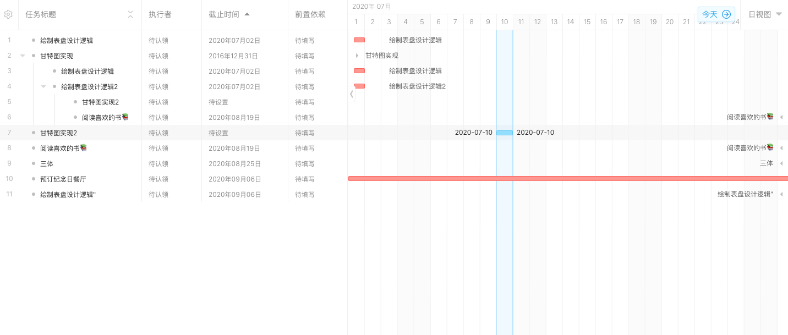

# ts-gantt

(Vue仿Teambition甘特图)

# 简介
  甘特图（Gantt chart）又称为横道图、条状图(Bar chart)、生产计划进度图。其通过条状图来显示项目，进度，和其他时间相关的系统进展的内在关系随着时间进展的情况。以提出者亨利·劳伦斯·甘特（Henry Laurence Gantt）先生的名字命名。  
  目前市面上最有名的几个gantt插件占据江湖了非常久远的时间，它们古老又强大。 
  但无一例外的是：它们收费或极其难用并且依赖非常古老的技术，其中有些技术现在入行的新手甚至从未听闻。  
 【jQueryGantt】【plusgantt】【dhtmlx】  不可否认它们都非常的强大，不管是从性能还是功能性。但是大多的业务需求并不需要如此庞然大物才能满足需求。 另一方面古老的技术稀缺的文档又让开发者无从下手（收费版甚至不提供文档，而你的老板又肯定不会提供钱买下授权）。  

 ts-gant 是仿照Teambition甘特功能 用Vue实现一些基本功能，仅供学习和业务开发时参考。

### 市面应用较广的大佬型插件

> jquery Gantt 笨重、老旧、较丑但文档还算清晰
  

> js gantt 不想多说了
  

> dhtmlxGantt 功能强大、全面；但是使用难度高，不切合现代框架及ui库，很难在项目中完美应用
  

> frappe-gantt 功能好少
  

> bryntum 唯一较美观的，但是可配置性差，无法和组件结合;不校验源数据正确性就报错、崩溃;规则死板不符合项目使用；收费年950$; 功能强大但文档只有简单介绍，详细用法只能控制台打印
  

## 快速上手

```bash
npm run serve
```

## 文档

###  Attributes 参数
| 序号 | 参数 | 说明 | 类型 | 可选值 | 默认值 | 注意 |
| ---- | ---- | ---- | ---- | ---- | ---- | ---- |
| 1 | data | 数据 | Task[] |  | [] |  |
| 2 | columns | 表格列字段数据 | Column[] | 任务标题、执行者、截止时间、前置依赖 | 不传 |  |  |
| 3 | viewType | 视图类型 | string | 支持日视图(day)、周视图(week)、月视图(month)、季视图(quarter)、年视图(halfYear) | day | TODO 待实现（增加该参数） |
| 4 | translateDate | 甘特图时间偏移值 | 支持dayjs对象 或标准时间字符串、日期对象、或ms时间戳 | | 当前时间 |  | TODO 待增加该参数 | |
| ... | 其他控制字段(待开发) | 控制排序，是否可编辑等 |  |  |  |  | 

### 数据类型定义要包含字段
#### Task 配置项
| 序号 | 参数 | 说明 | 类型 | 默认值 |
| ---- | ---- | ---- | ---- | ---- |
| 1 | children | 数据的子集children字段,表示为树表 [必须字段]| Task[] | [] |
| 2 | content  | 任务描述的内容，任务标题列[必须字段] | string |  | 
| 3 | executor | 执行人[必须字段] | String |  |
| 4 | startDate | 开始时间[必须字段] | 标准日期即可 string或Date |  | 
| 5 | endDate | 截止日期[必须字段] | 标准日期即可 string或Date |  | 
| 6 | collapsed | 是否折叠子任务 | boolean | false | 
| 7 | color | 外部可根据状态定义条状图颜色 | string |  |
| 7 | [x : tring ]: any | 其他扩展字段用户自定义 | any |  |  

#### Column 配置项
| 序号 | 参数 | 说明 | 类型 | 默认值 |
| ---- | ---- | ---- | ---- | ---- |
| 1 | width | 列的宽度配置 | number |  |
| 2 | minWidth | 列最小宽度 | number |  |
| 3 | name |  列的字段名称 | string | |
| 4 | visible | 是否隐藏列（暂未支持） | boolean |  |
| 5 | sortable | 是否可排序（暂未支持）| boolean |  |

### Events 事件
  | 序号 | 事件名 | 说明 | 回调参数 |
  | ---- | ---- | ---- | ---- |
  | 1 | onTaskCreate | 创建任务 | function(parent, task) 依次为任务数据与父级任务数据 |
  | 3 | onTaskDelete | 删除任务 | function(task)  依次为当前任务行数据 |
  | 4 | onTaskIndent | 任务左右移动切换父子任务 |  function(parent, task) 依次为左右移动的父任务、与移动当前任务 |
  | 5 | onTaskChangeContent | 任务内容发生变更 |  function(task, content, oldContent) 依次为当前行数据 |
  | 6 | onTaskTimeChange | 任务时间变更(时间dayjs类型) |  function(task, startDate, endDate) 依次为当前行数据 |
  | 7 | onToDetail | 进入详情 |  function(task) 当前行数据 |
  | 8 | onDragSort | 拖拽排序 |  function(preParent, parentTask, preIndex, index, handleTask) 移动前后父级任务及位置 |


### Methods 方法
### 版本记录
> 1.0.2 增加增加拖拽功能
 
> 1.0.0 完成甘特图的组件主要功能